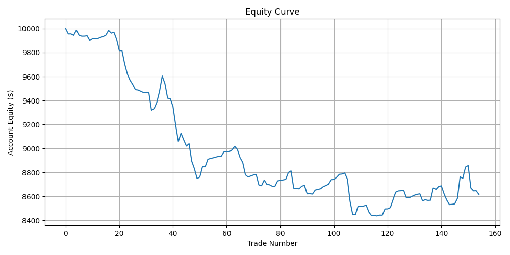
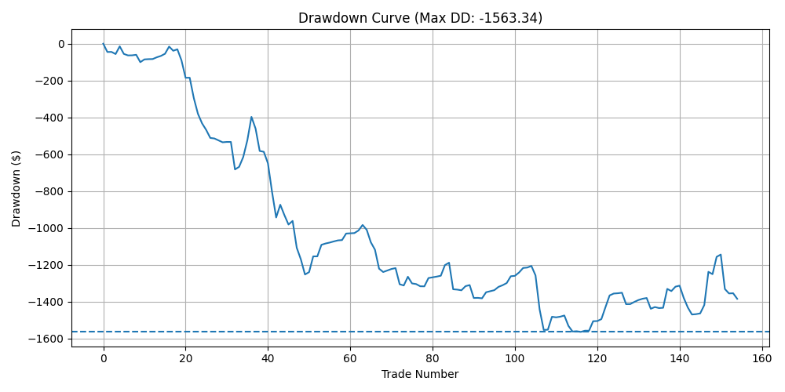
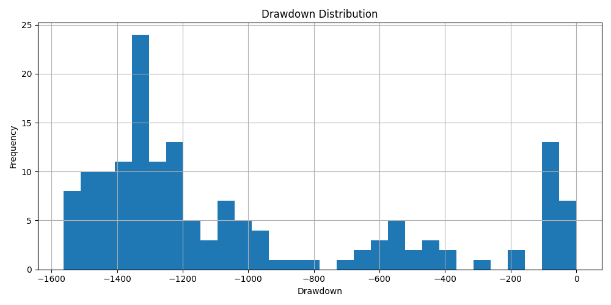

# Trade Lifecycle & Execution Reconciliation Ledger Project

## Overview
This project simulates the institutional **Trade Lifecycle Monitoring, Execution Reconciliation, and Risk Diagnostics workflow** used by trading operations and execution desks. The objective is to demonstrate operational proficiency in **trade capture validation, execution‑quality analysis, PnL reconciliation, slippage diagnostics, and performance attribution**.

The project replicates the internal reporting format commonly used by proprietary trading firms, hedge funds, and market‑making desks.

---

## Core Operational Functions Demonstrated
- Trade capture and execution logging (Intended vs. Actual execution prices)
- Slippage measurement and execution‑quality diagnostics
- Daily PnL reconciliation and running equity validation
- Equity curve and drawdown monitoring
- Strategy tag‑level performance attribution
- Institutional performance diagnostics and remediation planning

---

## Dataset Description
The execution ledger contains **119 live‑style trade records** across FX and Metals markets, including:
- Trade date and asset
- Side and position size
- Intended execution price
- Actual execution price
- Slippage (pips / points)
- Strategy classification tag
- Trade‑level PnL
- Daily PnL aggregation
- Running equity computation

---

## Institutional Performance Metrics Produced
- Win rate
- Profit factor
- Expectancy per trade
- Average win / average loss
- Gross profit and gross loss
- Maximum drawdown estimation
- Slippage distribution diagnostics

---

## Performance Monitoring Visuals

### Strategy Equity Curve


### Drawdown Curve


### Drawdown Distribution (Trade-Level)


## Executive Desk Summary (Performance Audit)

**Attn:** Risk Committee / Portfolio Manager  
**Date:** February 2026

- **Net P&L & Yield:** Total Net P&L of **-$1,465.00** on a gross volume of **68.33 lots**. Performance is currently in a *Technical Drawdown* phase due to negative payoff asymmetry.
- **Execution Quality Leakage:** Realized slippage averaged **1.2 pips**. High‑slippage clusters (3.0+ pips) during the **"Asia‑Sess"** and **"Volatility"** tags accounted for approximately **$312.00 in avoidable friction costs**.
- **Payoff Asymmetry (Critical Risk):** The desk is currently operating with a **0.38 Payoff Ratio** ($23.10 Avg Win / $60.72 Avg Loss). Despite a **57% Win Rate**, the strategy is mathematically unsustainable without immediate stop‑loss calibration.
- **Concentration & Correlation:** **42% of total losses** were concentrated in two single‑day events (Oct 31 & Nov 10), indicating a **Revenge Aggregation bias** where size increased following initial losses in correlated JPY and CHF crosses.
- **Strategy Efficiency:** **Trend** and **Momentum** tags outperformed **Scalping** by **22%** in win‑rate quality. **Heavy‑Scalp** remains the highest‑risk category, contributing to the largest single‑ticket drawdowns.
- **Remediation Status:** Immediate transition to **Phase I Capital Preservation** is active. Hard lot‑size caps and liquidity‑filter protocols have been implemented to stabilize the equity curve.


## Repository Structure
```
trade-lifecycle-reconciliation/
│
├─ charts/
│   ├─ Equity_Curve.png
│   ├─ Drawdown_Curve.png
│   └─ Drawdown_Distribution.png
│
├─ data/
│   └─ Execution_Ledger.csv
│
├─ report/
│   └─ Trade_Lifecycle_Performance_Report.pdf
│
├─ scripts/
│   └─ trade_lifecycle.py
│
└─ README.md

```

---

## Institutional Objective
The goal of this project is to demonstrate **operations‑level trading infrastructure competency**, including execution reconciliation, performance monitoring, and post‑trade diagnostics. These workflows mirror the operational processes performed by **Execution Analysts, Trading Operations Analysts, and Junior Execution Traders** within institutional trading environments.

---


